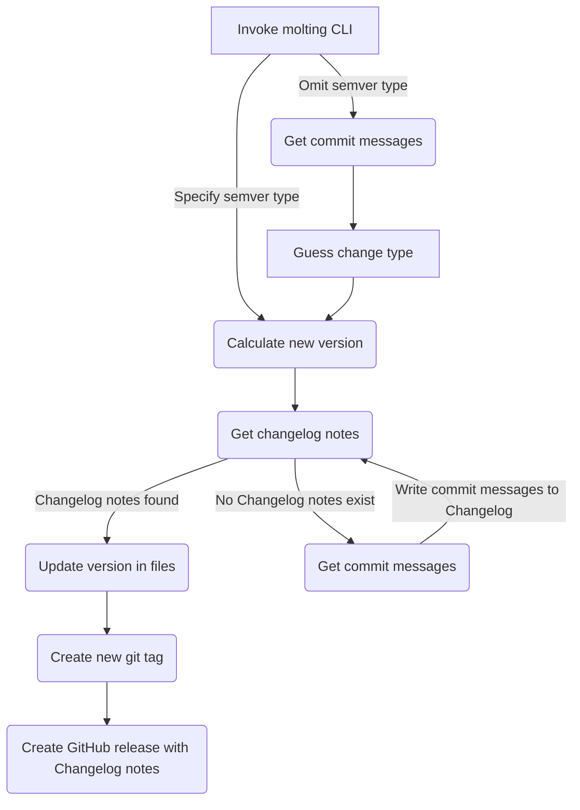

# 🐍🐍 molting

Automatically bump your project files to the latest version.

---

## Overview

Simplifies the process of creating new releases by bumping version numbers, updating release notes, and creating a GitHub release.

- **Easy to use** - Can be called without any arguments; let `molting` figure out the specifics.
- **Built for CI/CD** - Run from GitHub Actions or similar CI/CD tool to completely automate your release process.

## How it works

