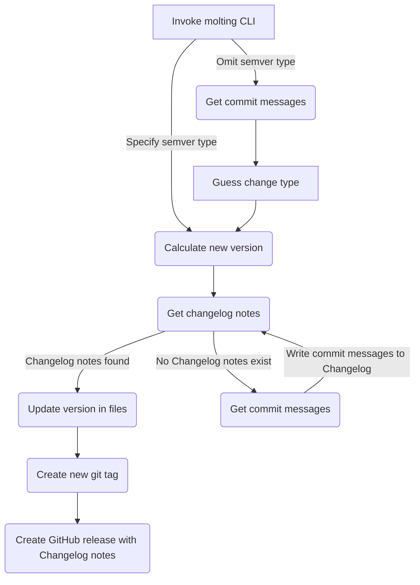

# 🐍 molting

Automatically bump your project files to the latest version.

```mermaid
graph TD
    A[Invoke molting CLI] -->|Specify semver type| B(Calculate new version)
    A -->|Omit semver type| C(Get commit messages)
    C --> D[Guess change type]
    D --> B
    B --> G(Get changelog notes)
    G -->|Changelog notes found| E(Update version in files)
    G -->|No Changelog notes exist| J(Get commit messages)
    J -->|Write commit messages to Changelog| G
    E --> F(Create new git tag)
    F --> K(Create GitHub release with Changelog notes)
```
